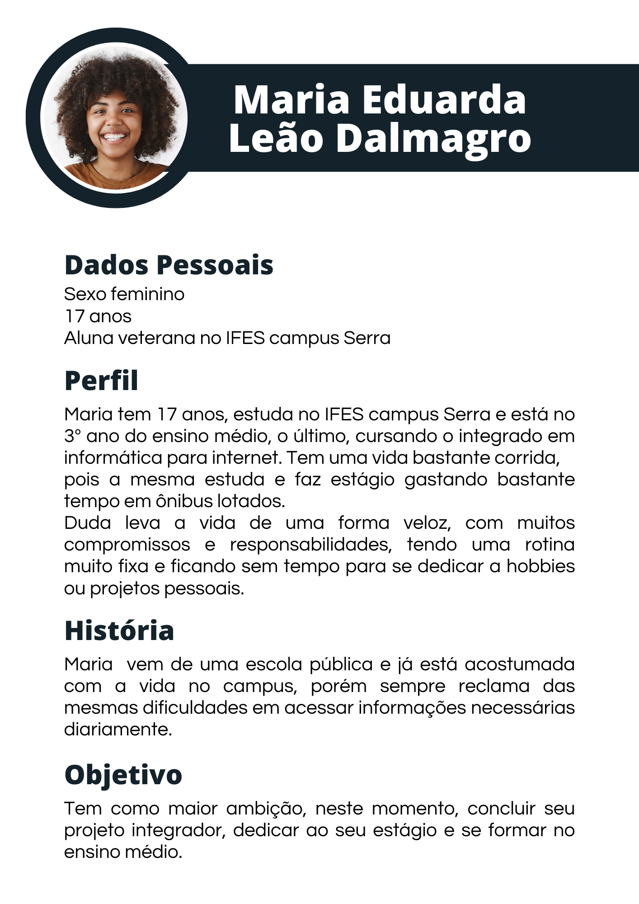
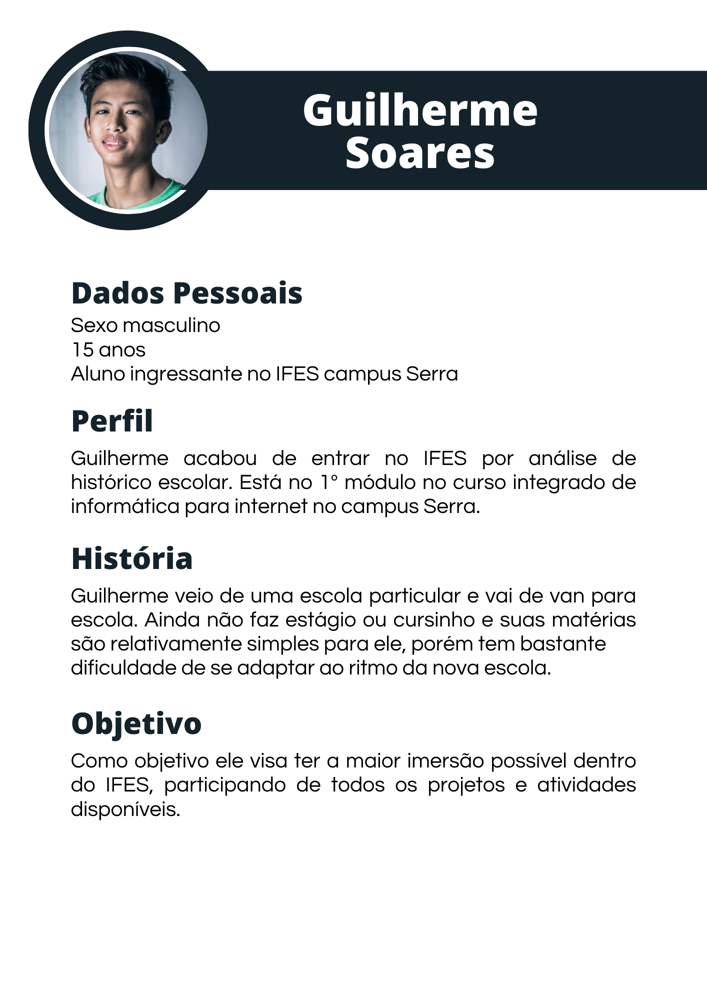
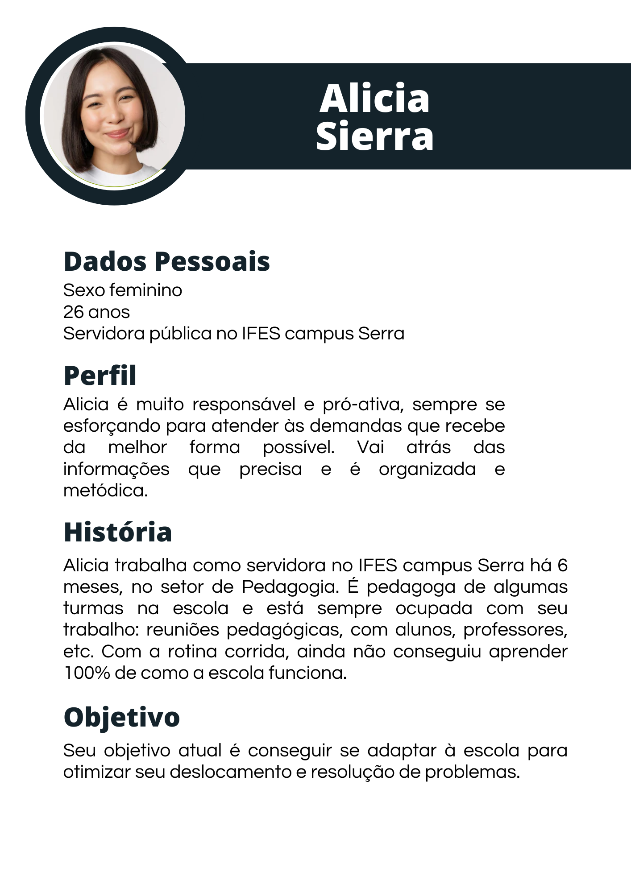
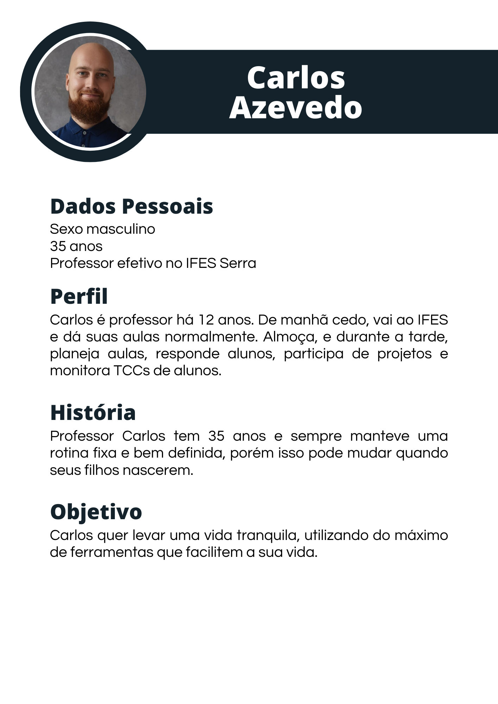

# TRABALHO DE PI: Título do Trabalho

Trabalho desenvolvido durante a disciplina de Banco de Dados do Integrado

# Sumário

### 1. COMPONENTES  

#### Integrantes do grupo:  

- Henrique Dalmagro: henriquedalmagro04@gmail.com
- Maria Eduarda de Souza Barros: maria123duarda@gmail.com
- Rafael Barros Leão Borges: rafaelbleaob@gmail.com

### 2. MINIMUNDO  

> O sistema proposto para "Manual do Calouro" conterá as informações aqui detalhadas. Dos usuários serão armazenados o nome, o login e a senha.  O usuário também poderá ser: padrão, servidor ou professor.  Cada usuário poderá ou não fazer parte de uma turma. Do servidor será armazenado o horário de funcionamento, e do professor será armazenado suas regras de sala. Além disso, os servidores e professores possuem várias formas de contato e suas respectivas salas.  As aulas serão compostas por: turma, dia da semana, horário de início e fim, disciplina e sala.  Para o calendário, que será o mesmo que o calendário acadêmico, cada usuário poderá armazenar anotações de eventos, que terão a data e a descrição.  Serão armazenados também os horários das aulas semanais de cada turma, com suas respectivas aulas.  O ROD será dividido e armazenado em parágrafos com temas, de forma que facilite a pesquisa. Haverá também uma forma simplificada de cada parágrafo.

### 3. PMC  

### 4. PERSONAS E HISTÓRIAS DE USUÁRIO  

a) Personas  
  
  
  
  

 

b) Histórias de usuário desenvolvidas pelo grupo  

#### Persona 1: Aluno Veterano

1. Eu, Maria Eduarda, quero mais facilidade em encontrar o telefone de um determinado departamento para encontrar quem resolve meu problema.
2. Eu, Maria Eduarda, quero mais facilidade em acessar meu horário de aulas para acompanhar minha rotina naquele dia.
3. Eu, Maria Eduarda, quero um calendário mais flexível para não precisar baixar outro arquivo quando há alguma mudança.
4. Eu, Maria Eduarda, quero um calendário interativo para fazer anotações sobre mudanças nos dias.
5. Eu, Maria Eduarda, quero acesso mais fácil e rápido ao ROD para poder lutar por meus direitos.
6. Eu, Maria Eduarda, quero um local com as regras de sala de cada professor para não precisar ficar lembrando das preferências individuais deles
7. Eu, Maria Eduarda, quero saber todos os horários de atendimento dos professores para tirar dúvidas com eles.
8. Eu, Maria Eduarda, quero saber os horários de atendimento dos departamentos para saber quando posso ir e resolver meus problemas.

 

#### Persona 2: Aluno ingressante

1. Eu, Guilherme, quero um mapa para saber onde ficam minhas salas de aula.
2. Eu, Guilherme, quero acesso ao ROD para aprender as regras do campus.
3. Eu, Guilherme, quero um acesso mais fácil ao horário de aulas para aprender minha nova rotina.
4. Eu, Guilherme, quero aprender os contatos dos meus professores para tirar dúvidas.
5. Eu, Guilherme, quero ter acesso aos perfis dos professores para aprender suas dinâmicas de sala.
6. Eu, Guilherme, quero ter acesso mais rápido ao calendário acadêmico para acompanhar meu ano letivo.
7. Eu, Guilherme, quero saber o horário de atendimento do pedagogo para tirar minhas dúvidas relacionadas à escola.
8. Eu, Guilherme, quero saber o contato do pedagogo para resolver problemas relacionados à escola.

 

#### Persona 3: Servidor

1. Eu, Alícia, quero acesso rápido e fácil ao mapa do campus para me localizar e saber o caminho mais rápido até o local que preciso ir.
2. Eu, Alícia, quero ter acesso a uma visão geral do ROD para aprender sobre os direitos e deveres dos servidores e alunos.
3. Eu, Alícia, quero ter acesso fácil aos horários de aula de minhas turmas para saber o melhor horário para ir dar recados.
4. Eu, Alícia, quero acesso a um calendário unido ao calendário acadêmico para programar mais rápido e fácil atividades e reuniões.
5. Eu, Alícia, quero poder disponibilizar meu contato de uma forma mais pública/visível para que minhas turmas consigam me contatar mais facilmente.
6. Eu, Alícia, quero acesso mais fácil aos parágrafos do ROD para responder dúvidas mais eficientemente.
7. Eu, Alícia, quero acesso mais fácil aos parágrafos do ROD para responder dúvidas com propriedade e rapidez.

 

#### Persona 4: Professor

1. Eu, Carlos, quero poder alterar o horário de um dia específico para avisar meus alunos de mudanças pontuais.
2. Eu, Carlos, quero um acesso mais fácil ao ROD para evitar problemas com o campus.
3. Eu, Carlos, quero poder alterar meus dados de contato para avisar meus alunos mais facilmente em caso de mudança.
4. Eu, Carlos, quero poder avisar, por meio do mapa, o local novo de aula para me preocupar com alunos perdidos.
5. Eu, Carlos, quero poder alterar meu horário de atendimento para deixar os alunos sabendo.
6. Eu, Carlos, quero ter acesso ao calendário acadêmico para saber com mais facilidade as datas dos meus sábados letivos.
7. Eu, Carlos, quero ter acesso ao calendário para me preparar para as reuniões e feriados.
8. Eu, Carlos, quero poder alterar minhas regras de sala no meu perfil para avisar meus alunos dessas mudanças.

 

 

### 5. RASCUNHOS BÁSICOS DA INTERFACE (MOCKUPS)  

[Protótipo Manual do Calouro](https://github.com/TeKel416/Template_Projeto_Integrador/blob/main/arquivos/Manual%20do%20Calouro%20-%20Prototipo%201.pdf?raw=true 'Protótipo - Manual do Calouro')

#### 5.1 QUAIS PERGUNTAS PODEM SER RESPONDIDAS COM O SISTEMA PROPOSTO?

    a) O sistema proposto poderá fornecer quais tipos de relatórios e informaçes?
    b) Crie uma lista com os 5 principais relatórios que poderão ser obtidos por meio do sistema proposto!

> A Empresa DevCom precisa inicialmente dos seguintes relatórios:

- Relatório que informe quais são os gerentes de cada departamento incluindo as seguintes informações: número do departamento, nome do departamento, e nome do gerente.
- Relatório de empregados por projeto incluindo as seguintes informações: número do projeto, nome do projeto, rg do empregado, nome do empregado e quantidade de horas de trabalho do empregado alocadas ao projeto.
- Relatório de empregados com dependentes incluindo as seguintes informações: rg do empregado, nome do empregado, nome do dependente, tipo de relação, data de nascimento do dependente e sexo do dependente.
- Relatório com a quantidade de empregados por cada departamento incluindo as seguintes informações: nome do departamento, supervisor e quantidade de empregados alocados no departamento.
- Relatório de supervisores e supervisionados incluindo as seguintes informações: nome do supervisor e nome do supervisionado.

### 6. TABELA DE DADOS DO SISTEMA:

[Tabela de Dados do Manual do Calouro](https://github.com/TeKel416/Template_Projeto_Integrador/blob/main/arquivos/Manual%20do%20Calouro%20Planilha.ods?raw=true 'Tabela - Manual do Calouro')

### 7. MODELO CONCEITUAL  

#### Principais Entidades:  

- Usuario
- Eventos
- Aula

#### 7.1 Descrição dos dados

**Usuario:** Tabela que armazena as informações relativas aos usuários do sistema.
id_user: campo que armazena o número de identificação única do usuário.
nome: campo que armazena o nome do usuário.
email: campo que armazena o e-mail utilizado para login do usuário.
senha: campo que armazena a senha criptografada para login do usuário.
ativo: campo que armazena o número que indica se a conta do usuário está ativa ou inativa.
acesso: campo que armazena o número que indica o nível de acesso permitido ao usuário.
img_perfil: campo que armazena o caminho da imagem de perfil do usuário.

    Servidor: Tabela que herda de Usuario e armazena as informações relativas aos usuários que são servidor público ou representante de um departamento no IFES Serra.
    horario_fim: campo que armazena o horário em que o usuário-servidor inicia seu horário de atendimento.
    horario_inicio: campo que armazena o horário em que o usuário-servidor finaliza seu horário de atendimento.

    Professor: Tabela que herda de Usuario e Servidor e armazena as informações relativas aos usuários que são professores no IFES Serra.
    regras: campo que armazena as regras de sala do usuário-professor.

    Turma: Tabela que armazena as informações relativas às turmas do ensino médio técnico no IFES Serra.
    id_turma: campo que armazena o número de identificação única de uma turma.
    dsc_turma: campo que armazena o nome da turma (ex: 3° ano Informática).

    Horario: Tabela que armazena as informações relativas aos horários das aulas.
    id_horario: campo que armazena o número de identificação única de cada par de horários.
    hora_fim: campo que armazena o horário de início de uma determinada aula.
    hora_inicio: campo que armazena o horário de término de uma determinada aula.

    Disciplina: Tabela que armazena as informações relativas às disciplinas ensinadas.
    id_disc: campo que armazena o número de identificação única de uma disciplina.
    dsc_disc: campo que armazena o nome da disciplina (ex: Projeto Integrador).

    Sala: Tabela que armazena as informações relativas às salas no IFES Serra.
    id_sala: campo que armazena o número de identificação única para cada sala no campus, sendo 0/1 + n° da sala (0 para térreo e 1 para superior).
    dsc_sala: campo que armazena o tipo da sala (ex: laboratório de biologia).

    Eventos: Tabela que armazena as informações relativas aos eventos no calendário.
    id_eventos: campo que armazena o número de identificação única para cada evento salvo pelo usuário.
    dsc_evento: campo que armazena a descrição/nome do evento marcado no calendário pelo usuário (ex: prova de recuperação de química).
    data_evento: campo que armazena a data e horário em que o evento irá acontecer.

    Tipo_contato: Tabela que armazena as informações relativas aos tipos de contato que um usuário-servidor e usuário-professor podem ter.
    id_tipo: campo que armazena o número de identificação único daquele tipo de contato.
    dsc_tipo: campo que armazena o tipo de contato (ex: email).

    Aula: Relacionamento que relaciona as informações relativas às aulas de cada turma, compostas por: dia da semana, horário, disciplina, professor, turma e sala.
    id_aula: campo que armazena o número de identificação único de uma aula.

    Tem: Relacionamento que relaciona as informações relativas ao contato de um usuário-servidor ou usuário-professor.
    id_contato: campo que armazena o número de identificação único daquele contato.
    dsc_contato:  campo que armazena o conteúdo do contato (ex: prof.omena@gmail.com).

### 8. RASTREABILIDADE DOS ARTEFATOS 

        a) Historia de usuários vs protótipo (mockup)
        b) Protótipo vs Modelo conceitual
        (não serão aceitos modelos que não estejam em conformidade)
        c) Backlog (caso solicitado)

### 9. MODELO LÓGICO 

        a) inclusão do esquema lógico do banco de dados
        b) verificação de correspondencia com o modelo conceitual
        (não serão aceitos modelos que não estejam em conformidade)

### 10. MODELO FÍSICO 

        a) inclusão das instruções de criacão das estruturas em SQL/DDL
        (criação de tabelas, alterações, etc..)

### 11. INSERT APLICADO NAS TABELAS DO BANCO DE DADOS 

        a) inclusão das instruções de inserção dos dados nas tabelas criadas pelo script de modelo físico
        (Drop para exclusão de tabelas + create definição de para tabelas e estruturas de dados

  + insert para dados a serem inseridos)
b) Criar um novo banco de dados para testar a restauracao
(em caso de falha na restauração o grupo não pontuará neste quesito)
c) formato .SQL

### 12. TABELAS E PRINCIPAIS CONSULTAS 

    OBS: Incluir para cada tópico as instruções SQL + imagens (print da tela) mostrando os resultados. 

#### 12.1 CONSULTAS DAS TABELAS COM TODOS OS DADOS INSERIDOS (Todas)  

#### 12.2 PRINCIPAIS CONSULTAS DO SISTEMA

Inserir as principais consultas (relativas aos 5 principais relatórios) definidas previamente no iten 3.1 deste template.
 
a) Você deve apresentar as consultas em formato SQL para cad um dos relatórios.
 
b) Além da consulta deve ser apresentada uma imagem com o resultado obtido para cada consulta. 

#### 12.3 ANTEPROJETO VERSÃO 1

Link para [Modelo de Anteprojeto](https://docs.google.com/document/d/1oeVS2CUffbSNYWxIWZFY_mX6E5ao_PHU/edit?usp=sharing&ouid=104104747195236161434&rtpof=true&sd=true)

  
  
 
 
 
 
 ### 13. Gráficos, relatórios, integração com Linguagem de programação e outras solicitações. 
     OBS: Observe as instruções relacionadas a cada uma das atividades abaixo. 
 #### 13.1	Integração com Linguagem de programação;  
 #### 13.2	Desenvolvimento de gráficos/relatórios pertinentes, juntamente com demais  
 #### solicitações feitas pelo professor.  
 #### 13.3 ANTEPROJETO VERSÃO 2
  
  
 
 
 ### 14. Slides e Apresentação em vídeo.  
     OBS: Observe as instruções relacionadas a cada uma das atividades abaixo. 
 #### 14.1 Slides;  
 #### 14.2 Apresentação em vídeo  
 #### 14.3 ANTEPROJETO VERSÃO FINAL
  
  

##### About Formatting

    https://help.github.com/articles/about-writing-and-formatting-on-github/

##### Basic Formatting in Git

    https://help.github.com/articles/basic-writing-and-formatting-syntax/#referencing-issues-and-pull-requests

##### Working with advanced formatting

    https://help.github.com/articles/working-with-advanced-formatting/

#### Mastering Markdown

    https://guides.github.com/features/mastering-markdown/

### OBSERVAÇÕES IMPORTANTES

#### Todos os arquivos que fazem parte do projeto (Imagens, pdfs, arquivos fonte, etc..), devem estar presentes no GIT. Os arquivos do projeto vigente não devem ser armazenados em quaisquer outras plataformas.

1. Caso existam arquivos com conteúdos sigilosos, comunicar o professor que definirá em conjunto com o grupo a melhor forma de armazenamento do arquivo.

#### Todos os grupos deverão fazer Fork deste repositório e dar permissões administrativas ao usuário deste GIT, para acompanhamento do trabalho.

#### Os usuários criados no GIT devem possuir o nome de identificação do aluno (não serão aceitos nomes como Eu123, meuprojeto, pro456, etc). Em caso de dúvida comunicar o professor.

Link para BrModelo: 
http://sis4.com/brModelo/brModelo/download.html
 

Link para curso de GIT 

